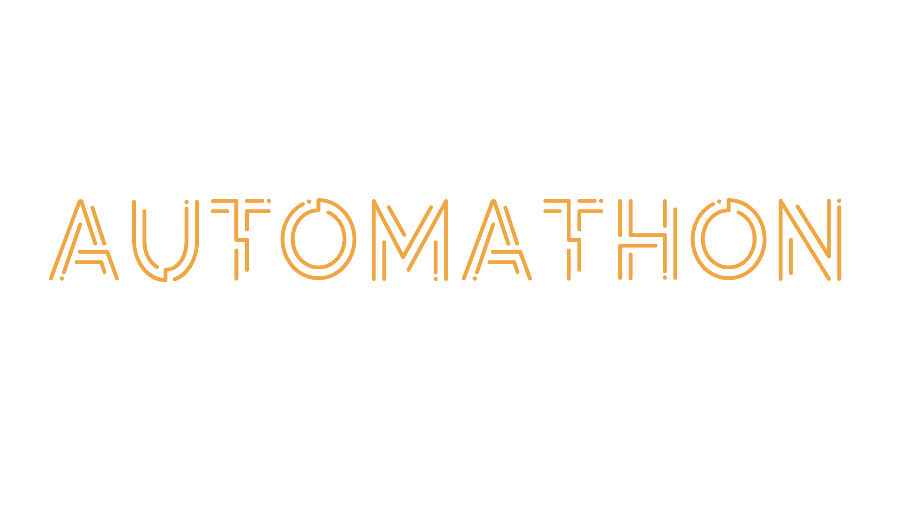

# Automathon 2024



Welcome to our solution for the deepfake detection hackathon offered by CentraleSupélec's IA automatans association!

- We used the EfficientNet model to train a 2D convulational network:

https://pytorch.org/vision/stable/models/generated/torchvision.models.efficientnet_b0.html#torchvision.models.efficientnet_b0

- We did a frame-by-frame detection

- In pre-processing, we cropped the faces using box detection and the MTCNN method. 

- We chose to use nn.CrossEntropyLoss() instead of nn.MSELoss()

Link to the competition :

https://www.kaggle.com/competitions/automathon-deepfake/overview

## Setup DGX

Once we've given you your DGX access and SSH keys in the `accountX` folder

follow these instructions:

1. Run the script

```bash
cd compte8
python3 dgx_setup.py
```

*Note: number 8 is an example, please enter your team number*.

The script will run and give you your password.

```
Your password is jbk47rgdfEFH
```

*Note: this password is purely fictitious*.

2. Try to connect

```bash
ssh dgx
```
You will then be asked for your password.

3. Change your account password

Once logged in, change your password to something else

```bash
passwd
Old Password: <PASSWORD>
New password: <PASSWORD>
```

## Setup Local

1. Connect to Github

Once you've checked that we've taken your Github account, click on the button below to open a new browser window in which you can connect to your Github account.

[](https://github.com/)

2. Create your own SSH keys

If you don't already have an SSH key, run:

```bash
ssh-keygen
```

3. Put your personal SSH keys in your Github account

[](https://github.com/settings/keys)

you can find your keys with the following command:

```bash
cat ~/.ssh/id_rsa.pub
```

4. Clone the repository

```
git clone git@github.com:Automatants/automathon-2024.git
```

5. Step into the virtual environment

```bash
cd automatonhackathon-2024
source .venv/bin/activate
```

At any time, to exit the virtual environment execute:

```bash
deactivate
```

5. Install project dependencies

```bash
pip install -r requirements.txt
```

## Usage

The repo has 2 files:

1. A `baseline.ipynb` which is used to explain dataset details, and for local testing.

2. a `run.py` which is used to run the project on DGX.

To run run.py, connect to DGX:

```bash
ssh dgx
cd automatonhackathon-2024
git pull
./run
```


